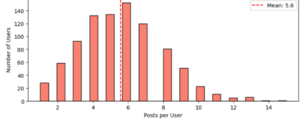
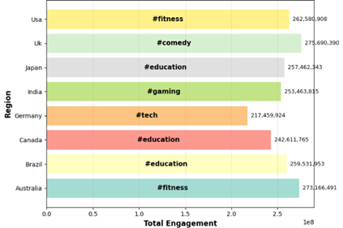
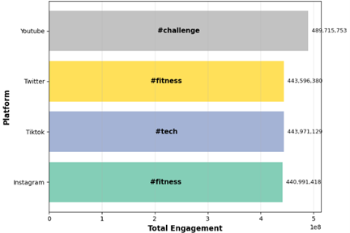
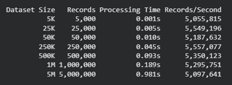
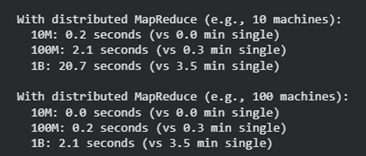

# Social Media Trend Analysis (MapReduce-Based)

## Overview
This project analyzes large-scale social media data to identify trends, user behavior, and engagement patterns using a custom MapReduce implementation.

The system demonstrates how distributed computing concepts can be applied to efficiently process and analyze huge data.

---

## Problem
Social media platforms generate massive amounts of data every second, making it difficult to analyze trends using traditional methods.

This project addresses this challenge by simulating a MapReduce system to process large datasets and extract meaningful insights.

---

## Dataset
- Social media dataset containing posts with:
  - hashtags
  - platforms (TikTok, Instagram, Twitter, YouTube)
  - regions
  - engagement metrics (likes, views, shares, comments)
- Original dataset (~5,000 posts)
- Expanded datasets up to **5 million posts** for scalability testing

---

## Methodology

### Data Processing
- Cleaned and standardized dataset:
  - lowercased hashtags
  - removed duplicates and missing values
  - formatted dates
- Generated 895 unique user IDs
- Created **engagement score** combining multiple metrics

### MapReduce Implementation
A custom MapReduce system was built with:
- **Map step:** transform data into key-value pairs  
- **Reduce step:** aggregate results  

### Analysis Tasks
- Hashtag frequency
- Trends by region
- Trends by platform
- Engagement-weighted trends
- User activity analysis
- Top users by engagement

---

## Key Results

### Trend Insights
- A small number of hashtags dominate global trends  
- Some trends are global, while others are region-specific  
- Platform behavior differs significantly  

### Engagement Insights
- High engagement does not always correlate with frequency  
- Some less frequent hashtags generate higher impact  

### User Behavior
- Most users post infrequently  
- A small number of users generate most content

---

## Visualizations
### User Activity Distribution

### Trending Hashtags by Region

### Trending Hashtags by Platform

---

## Scalability Analysis
- Tested dataset sizes from **5K to 5 million records**
- Processing time increased linearly
- Demonstrates limitations of single-machine processing

Key insight:
> Distributed systems (e.g., Hadoop/Spark) are essential for large-scale data processing

---

## Scalability Results

### Performance Summary

This table shows how processing time scales with dataset size, demonstrating near-linear growth as data increases.

---

### Distributed Computing Benefits

This comparison highlights how distributed systems drastically reduce processing time compared to a single machine.

---

## Tools & Technologies
- Python  
- Pandas  
- MapReduce (custom implementation)  
- Google Colab  

---

## Key Takeaways
- MapReduce enables scalable data processing  
- Data cleaning is critical for reliable insights  
- Big data requires distributed systems for efficiency  

---

## Future Improvements
- Implement using Apache Spark or Hadoop  
- Real-time streaming analysis  
- Interactive dashboards (Tableau / Power BI)  

---

## Conclusion
This project demonstrates how big data techniques can be applied to analyze social media trends at scale. By combining data cleaning, distributed processing concepts, and analytical insights, it provides a practical example of real-world data analysis challenges and solutions.
